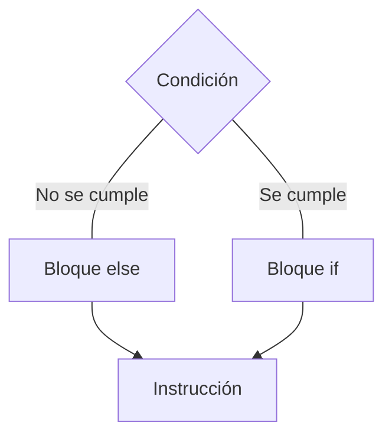
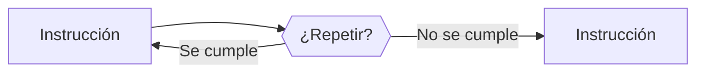

# Curso de Python

[Web oficial de Python](https://www.python.org/)

[Guía de estilo - PEP 8](https://peps.python.org/)

[Paquetes](https://pypi.org/)

## Indice

- [Comentarios](#comentarios)
- [Variables](#variables)
- [Operadores matemáticos](#operadores-matematicos)
- [Operadores lógicos](#operadores-logicos)
- [Funciones incorporadas](#funciones-incorporadas)
- [Estructura de datos](#estructura-de-datos)
- [Condicionales](#condicionales)
- [Ciclos](#ciclos)
- [Funciones](#funciones)
- [Función lambda](#funcion-lambda)
- [Módulos](#modulos)
- [Paquetes](#paquetes)
- [Programación orientada a objetos](#programacion-orientada-a-objetos)
- [Clases](#clases)
- [Librerías](#librerias)
- [Entorno virtual](#entorno-virtual)
- [Errores/Excepciones](#errores-excepciones)

## Comentarios

[Indice](#indice)

Los comentarios son líneas de código no ejecutadas por el programa.

- Explicar código.
- Prevenir que el código sea ejecutado.

Comentarios de una línea

```python
# Comentario de una línea
```

```python
"""
Comentarios
multilínea
"""
```

## Variables

[Indice](#indice)

Objeto con un valor almacenado en memoria que puede cambiar con el tiempo. Se definen con un nombre. Se pone un signo `=` para indicar que se le asigna un valor y se le asigna el valor. No se requiere definir el tipo de dato.

La función `type()` permite conocer el tipo de dato de una variable.

### Tipos de variables

- String o cadena de texto.
- Números enteros.
- Números decimales o flotantes.
- Booleanos.

#### String

Cadena de caracteres, unión de letras y símbolos. Al encerrar el valor entre comillas simples o dobles Python identifica variables de tipo texto.

**Type**: `<class 'str'>`

```python
name = "Juan"
```

#### Entero

Números que no tienen parte decimal o fracción. Se identifica solo con el número.

**Type**: `<class 'int'>`

```python
age = 30
```

#### Decimal

Números que tienen parte decimal o fraccionaria. Se identifica con el punto como separador decimal.

**Type**: `<class 'float'>`

```python
height = 1.70
```

#### Booleano

**Type**: `<class 'bool'>`

```python
positive = True
negative = False
```

## Operadores matematicos

[Indice](#indice)

### Suma

```python
2 + 2 # 4
```

### Resta

```python
2 - 2 # 0
```

### Multiplicación

```python
2 * 2 # 4
```

### División

```python
2 / 2 # 1.0
```

El resultado de las divisiones siempre es un número decimal.

### Módulo

```python
2 % 2 # 0
```

### Potencia

```python
2 ** 2 # 4
```

El primer número es la base y el segundo número es la potencia.

### Concatenar texto

```python
"Hola" + "Mundo" # HolaMundo
```

### Multiplicar texto

```python
"Hola" * 2 # HolaHola
```

## Operadores logicos

[Indice](#indice)

Devuelve `True` o `False`

### Mayor

```python
1 > 2 # False
```

### Menor

```python
1 < 2 # True
```

### Mayor o igual

```python
1 >= 2 # False
```

### Menor o igual

```python
1 <= 2 # True
```

### Comparación de igualdad

```python
1 == 2 # False
```

### Comparación de diferencia

```python
1 != 2 # True
```

## Funciones incorporadas

[Indice](#indice)

### int

Convierte un valor a un número entero.

```python
int(1.23) # 1
```

### float

Convierte un número entero a un número decimal.

```python
float(3) # 3.0
```

### str

Convierte cualquier valor a una cadena de texto

```python
str(True) # "True"
```

### type

Devuelve el tipo de una variable u objeto.

```python
type(1) # <class 'int'>
```

### help

Devuelve la documentación de una función.

```python
help(int)

"""Help on class int in module builtins:

class int(object)
 |  int([x]) -> integer
 |  int(x, base=10) -> integer
 |
 |  Convert a number or string to an integer, or return 0 if no arguments
 |  are given.  If x is a number, return x.__int__().  For floating-point
 |  numbers, this truncates towards zero.
 |
 |  If x is not a number or if base is given, then x must be a string,
 |  bytes, or bytearray instance representing an integer literal in the
 |  given base.  The literal can be preceded by '+' or '-' and be surrounded
 |  by whitespace.  The base defaults to 10.  Valid bases are 0 and 2-36.
 |  Base 0 means to interpret the base from the string as an integer literal.
 |  >>> int('0b100', base=0)
 |  4
 |
 |  Built-in subclasses:
 |      bool
 |
 |  Methods defined here:
 |
 |  __abs__(self, /)
 |      abs(self)
 |
-- Más  --"""
```

## Estructura de datos

[Indice](#indice)

Conjuntos o colecciones de datos que permiten orgenizarlos, manipularlos, extraerlos, buscarlos o insertarlos. Son eficientes. Pueden modificarse después de ser creados (mutables).

- Listas
- Tuplas
- Diccionarios
- Sets

### Listas

Se definen entre corchetes. Permite duplicados. Ordenado, mantiene el orden en el que fue definida. Mutable. Puede contener todo tipo de datos.

```python
lista = [1, True, 2, "Juan", 3.0]
```

Acceder a un elementos a través de su índice

```python
lista[0] # 1
```

Longitud de la lista

```python
len(lista) # 5
```

Último elemento índice negativo

```python
lista[-1] # 3.0
```

Primer elemento índice negativo

```python
lista[-len(lista)] # 1
```

Acceder a una parte de la lista `a:b`, `a` el primer elemento, `b` el elemento siguiente al último que se quiere acceder.

```python
lista[1:3] # [True, 2]
```

Lista anidada

```python
lista_anidada = [lista, False, 4, "Carlos", 1.0] # [[1, True, 2, 'Juan', 3.0], False, 4, 'Carlos', 1.0]
```

Acceder a un elemento de una lista anidada

```python
lista_anidada[0][1] # True
```

Modificar un elemento

```python
lista[3] = "Juan Carlos" # [1, True, 2, 'Juan Carlos', 3.0]
```

Añadir elemento en la última posición

```python
lista.append(False) # [1, True, 2, 'Juan Carlos', 3.0, False]
```

Agregar elementos de un iterable

```python
lista.extend(["Batman", 13, True]) # [1, True, 2, 'Juan Carlos', 3.0, False, 'Batman', 13, True]
```

### Tuplas

Se definen entre paréntesis o elementos separados por coma. Permiten duplicados. Ordenadas. No son mutables. Se utilizan cuando sus valores no se deben modificar o si se requiere menor tiempo de procesamiento.

```python
nums = (1, 2, 3)
nums = 1, 2, 3
```

### Diccionarios

Se definen entre llaves. Cada elementos es una combinación de una clave y un valor. No es ordenado. Mutable. No permite duplicados. Las claves son únicas. Las claves y valores pueden ser de cualquier tipo de dato.

```python
person = {"name": "Juan", "age": 30}
```

Acceder al valor de una clave

```python
person["name"] # Juan
```

Agregar clave y valor

```python
person["height"] = 1.7
```

Acceder a todas las claves y valores

```python
person.items() # dict_items([('name', 'Juan'), ('age', 30), ('height', 1.7)])
```

Acceder a las claves

```python
person.keys() # dict_keys(['name', 'age', 'height'])
```

Acceder a los valores

```python
person.values() # dict_values(['Juan', 30, 1.7])
```

### Sets

Se definen entre llaves. No permite duplicados. No es ordenado. Mutable.

```python
set_test = {1, 2, 3, 3} # {1, 2, 3}
```

Agregar un elemento

```python
set_test.add(4)
```

Agregar varios elementos

```python
set_test.update(["uno", "dos", "tres"])
```

Obtener la cantidad de elementos

```python
len(set_test) # 7
```

Eliminar un elemento

```python
set_test.discard("dos")
```

```python
set_test.remove("uno")
```

> [!WARNING]
> Arroja un error si el elemento no existe.

Vaciar el set

```python
set_test.clear()
```

## Condicionales

[Indice](#indice)

Instrucción que se ejecuta o no al cumplirse una condición. Dependen de una condición lógica.

### Condiciones lógicas

- Igual `==`
- Diferente `!=`
- Menor `<`
- Mayor `>`
- Menor o igual que `<=`
- Mayor o igual que `>=`
- `is`
- `and`
- `or`
- `not`

Retornan `True` o `False`



```python
if <condición lógica>:
    print("if block")
elif <cóndición lógica>:
    print("Elif block")
else:
    print("Else block")
```

## Ciclos

[Indice](#indice)

Instrucción que se repite hasta que se cumple una condición.

### Instrucciones que modifican el flujo de los ciclos

- `break`: Termina el ciclo.
- `continue`: Pasa al siguiente elemento.

### Tipos de ciclos

- For
- While



#### For

Itera sobre cada elemento de una estructura de datos.

```python
for <element> in <object>:
    print("Elemento:" <element>)
```

Iterar sobre un rango de números, desde el primero número indicado hasta el anteúltimo indicado. Si se indica un solo número es desde el 0 hasta el anteúltimo indicado.

```python
for element in range(10):
    print(element)
```

Iterar sobre un diccionario

```python
person = {
    "name": "Juan",
    "age": 30
}

for key in person:
    print("Clave", key)
    print("Valor", person[key])
```

#### While

Ejecuta una o más instrucciones mientras se cumpla una condición.

```python
while <condición>:
    print("Ciclo While")
```

### Iterables

Conjunto de elementos. Permiten retornar los elementos que los componen. Se recorren usando ciclos para obtener sus elementos.

- Cadenas de texto
- Listas
- Tuplas
- Diccionarios

### Iteradores

Objetos. Permiten recorrer un objeto iterable. Objeto que permite obtener de un objeto iterable cada uno de los elementos que lo componen.

#### Crear iteradores

- La función `iter()` permite recorrer el iterable.
- La función `next()` retorna el elemento siguiente en el iterable.

```python
numeros = [1, 2, 3]
iterador = iter(numeros)
next(iterador)
```

## Funciones

[Indice](#indice)

Bloques de código independientes con instrucciones relacionadas entre sí encargadas de cumplir una tarea. Organizan el código en partes pequeñas. Permite la organización y usabilidad del código. Evita la repitición de instrucciones y permite reutilizarlo.

- **Parámetro**: Variables que referencian a los datos que ingresan a la función. El parámetro es el nombre de la variable.
- **Argumento**: Valores asignados a cada uno de los parámetros de la función cuando la función se ejecuta.
- **\*args**:Non-keyword arguments. Parámetros especiales usados para pasar parámetros opcionales en forma de lista. Cada posición en la lista de ese parámetro será usado en la función.

```python
def calcular_perimetro(lado_1, lado_2, lado_3, lado_4):
    perimetro = lado_1 + lado_2 + lado_3 + lado_4
    return perimetro

def calcular_perimetro(*args):
    perimetro = 0
    for lado in args:
        perimetro += lado
    return perimetro

perimetro = calcular_perimetro(1, 2, 3, 4)
print(perimetro)

triangulo = calcular_perimetro(1, 2, 3)
print(triangulo)
```

- **\*\*kwargs**: Keyword arguments. Parámetros especiales usados en las funciones para pasar parámetros opcionales en forma de diccionario. Cada parámetro tiene un nombre asignado que sería la clave del diccionario y un valor asociado. Cuando queremos definir parámetros no definidos dentro de la función.

```python
def funcion_kwargs(**kwargs):
    print(kwargs)
    for clave, valor in kwargs.items():
        print(f"Clave: {clave} - Valor: {valor}")
    print(kwargs["nombre"], kwargs["apellido"])


funcion_kwargs(nombre="Juan Carlos", apellido="Batman")
```

- **Retorno**: Elemento que regresa la función como resultado del proceso o tarea que realiza.

Orden de parámetros

1. Parámetros definidos desde la función
2. args
3. kwargs

```python
def parametros_ordenados(nombre, apellido, *args, **kwargs):
    pass

def parametros_desordenados(nombre, apellido, **kwargs, *args):
    pass
```

```python
def <nombre_funcion>(param1, param2):
    <instrucción>
    return <valor_retorno>

<nombre_funcion>(arg1, arg2)
<nombre_funcion>(param1=arg1, param2=arg2)
valor_retorno = <nombre_funcion>()
```

```python
def calcular_area_cuadrado(lado):
    """Calcular el área de un cuadrado"""
    area = lado * lado
    return area

area_cuadrado = calcular_area_cuadrado(lado=5)
print(area_cuadrado)
```

Devolver más de un valor separados por una coma

```python
def <nombre_funcion>():
    <instrucción>
    return <valor_retorno1>, <valor_retorno2>, <valor_retorno3>

valores_retorno = <nombre_funcion>()
# (valor_retorno1, valor_retorno2, valor_retorno3)

valor_retorno1, valor_retorno2, valor_retorno3 = <nombre_funcion>()
# valor_retorno1, valor_retorno2, valor_retorno3
```

### Tipos de funciones

- Built-in functions: Creadas para tareas comunes sin necesidad de instalación.
- User-defined functions: Creadas por los desarrolladores para cada proyecto.

### Documentar función / docstring

- Docstring corta:

```python
def <nombre_funcion>():
    """Descripción de la función"""
    <instrucción>
    return <valor_retorno1>, <valor_retorno2>, <valor_retorno3>
```

- Docstring larga:

```python
def <nombre_funcion>():
    """Descripción de la función

    Descripción larga y detallada

    Args:
        param1 (int): descripción arg1
        param2 (int): descripción arg2
    Return:
        valor_retorno (int): descripción valor_retorno
    """
    <instrucción>
    return <valor_retorno1>, <valor_retorno2>, <valor_retorno3>
```

## Funcion lambda

Se compone de una sola expresión. Toma uno o más argumentos. Tareas simples. Que no se repitan mucho. Funciones anónimas.

```python
lambda argumentos: expresión
```

- `lambda`: Sentencia que invoca la función.
- `argumentos`: Argumentos que recibe la función.
- `expresión`: Cuerpo de la función.

Desde la terminal

```python
lambda num: num*2
_(2,)

(lambda num: num*2)(2,)

multiplicacion = lambda num: num*2
multiplicacion(2)
```

Reemplazar función convencional por lambda

```python
def calcular_area_cuadrado(lado):
    return lado ** 2

calcular_cuadrado = lambda lado: lado ** 2
print(calcular_cuadrado(2))
```

Uso con la función `filter`

```python
lista_numeros = [1, 2, 3, 4, 5, 6, 7, 8]

lista_pares =list(filter(lambda numero: numero % 2 == 0, lista_numeros ))
print(lista_pares)
```

Uso con la función `map`

```python
lista_numeros = [1, 2, 3, 4, 5, 6, 7, 8]

nueva_lista =list(map(lambda numero: numero * 10, lista_numeros))
print(nueva_lista)
```

## Modulos

[Indice](#indice)

Librerías adicionales al código base de Python que contienen funciones. Los módulos hacen referencia a archivos de Python que pueden contener una o varias funciones. Las librerías son paquetes desarrollados por la comunidad.

### Importar librerías, módulos

```python
import <módulo>
```

Simplificar nombre

```python
import <módulo> as md
```

Importar submódulo

```python
from <módulo> import <submódulo>
```

## Paquetes

[Indice](#indice)

Los paquetes son carpetas que contienen módulos. Los paquetes deben contener un archivo de inicialización init.

- Crear carpeta
- Crear archivo `__init__.py`, dejarlo vacío. El archivo le indica a Python que la carpeta creada es un paquete y sus archivos son módulos.

## Programacion orientada a objetos

[Indice](#indice)

Paradigma de programación. Todos los datos son objetos. Permite modelar cosas de la vida real. Los objetos son elementos o instancias creadas a partir de una clase. Los objetos tienen atributos y métodos. Los atributos son características que definen al objeto. Los métodos son las funciones que tiene un objeto.

- Abstracción: Define características y funcionalidades de un objeto. Plano a partir del que se crea un objeto.
- Encapsulamiento: Evita que los objetos se manipulen de manera incorrecta.
- Herencia: Crear el plano de un objeto hijo a partir del plano de un objeto padre. Comparten características y funciones.
- Polimorfismo: Hace referencia a cada objeto creado a partir del mismo plano y responde de manera diferente ante una función.

## Clases

[Indice](#indice)

Plano a partir del que se crean objetos. El nombre de la clase en mayúscula.

```python
class NombreClase:
    pass
```

Los valores iniciales del objeto se definen en el método **init** que es el constructor de la clase que se ejecuta cuando se crea el objeto. El constructor y todos los métodos de la clase reciben como primer parámetro **self** que representa la instancia de la clase.

```python
class NombreClase:
    def __init__(self):
        print("SELF")
```

### Tipos de atributos

- Atributos de instancia: Se definen dentro de la función **init**.

```python
class Person:
    def __init__(self, name, age):
        self.name = name
        self.age = age

person = Person("Juan", 30)
```

Acceder a un atributo

```python
person.name
person.age
```

- Atributos de clase

```python
class Person:
    god = True
    def __init__(self, name, age):
        self.name = name
        self.age = age

person = Person("Juan", 30)

person.god
```

### Métodos de clase

Funciones que se definen dentro de una clase. Recibe como primer atributo **self**.

```python
class Persona:

    god = True

    def __init__(self, name, age):
        self.name = name
        self.age = age
        self.dead = False

    def die(self):
        self.dead = True

person = Person("Juan", 30)
person.die()
```

### Herencia de clase

Permite crear una clase a partir de otra. La clase secundaria aprovecha atributos y métodos de la principal para reutilizar código existente. Hereda el constructor de la clase padre. Para conservar los atributos de la clase padre se usa la función `super` dentro del constructor.

```python
class Persona:

    def __init__(self, nombre, edad):
        self.nombre = nombre
        self.edad = edad

    def cumplir_anios(self):
        self.edad += 1
        print(f"Feliz cumpleaños #{self.edad} {self.nombre}")

class Empleado(Persona):

    def __init__(self, horas_totales, nombre, edad):
        super(Empleado, self).__init__(nombre, edad)
        self.horas_totales = horas_totales

    def trabajar(self, horas_trabajadas):
        self.horas_totales += horas_trabajadas
        print(f"Usted ha trabajado {horas_trabajadas} horas")
        print(f"Horas totales: {self.horas_totales}")

paco = Empleado(nombre="Paco", edad=20, horas_totales=30)
paco.trabajar(horas_trabajadas=8)
paco.cumplir_anios()
```

## Librerias

[Indice](#indice)

Instalar librería

```
pip install flask
```

Instalar una versión en particular

```
pip install pandas==1.3.4
```

Listar librerías instaladas

```
pip freeze
```

Desinstalar librería

```
pip uninstall pandas
```

## Entorno virtual

[Indice](#indice)

Entorno aislado para cada proyecto que se desarrolla. Contienen los paquetes necesarios para el proyecto. Permite el manejo de paquetes y versiones entre proyectos. Facilidad para borrar paquetes en caso de conflictos.

### Crear entorno virtual

- virtualenv

```powershell
pip install virtualenv
virtualenv env
env\Scripts\activate # Activar el entorno
deactivate # Desactivar el entorno
rmdir env /s # Eliminar el entorno
```

- venv
- anaconda

### Archivo de requerimientos

Archivo de texto plano que contiene todas las librerías que se requieren para un proyecto. El standard para la creación del archivo es `requirements.txt`.

```
flask==2.0.2
```

Instalar librerías requeridas

```
pip install -r requirements.txt
```

## Errores Excepciones

[Indice](#indice)

- Errores de sintaxis: Ocurre cuando una instrucción está mal escrita. Se identifica si aparece `SyntaxError`.
- Excepciones: Ocurren cuando se genera un error aunque la sintaxis este escrita correctamente. Ocurren durante la ejecución del programa. Pueden programarse usando la instrucción `Raise Exception` cuando queremos que el código termine en un error.

```python
def validar_x(x):
    if x < 1:
        raise Exception("La variable x debe ser mayor a 1")
    else:
        print("x es mayor a 1")

x = 0.3
validar_x(x)
```

### Assertion errors

Errores que pueden levantarse al cumplirse una condición, no es necesario escribir explícitamente la condición. El assert valida la condición y si no se cumple levanta el error.

```python
def calcular_promedio(lista):
    assert len(lista) > 0, "La lista está vacía"
    return sum(lista) / len(lista)

promedio = calcular_promedio(lista=[])
```

### Capturar errores con try except

Dentro del bloque `try` se encuenta el código que debe ejecutarse para completar el programa. Dentro del bloque `except` se encuentran las instrucciones que se ejecutan cuando algo dentro del bloque `try` falla.

```python
def calcular_promedio(lista):
    assert len(lista) > 0, "La lista está vacía"
    return sum(lista) / len(lista)

try:
    promedio = calcular_promedio(lista=[])
    print(promedio)
except AssertionError as assert_error:
    print(assert_error)
except Exception as e:
    print("La función no calculó el promedio")
    print(e)
```

```

```
